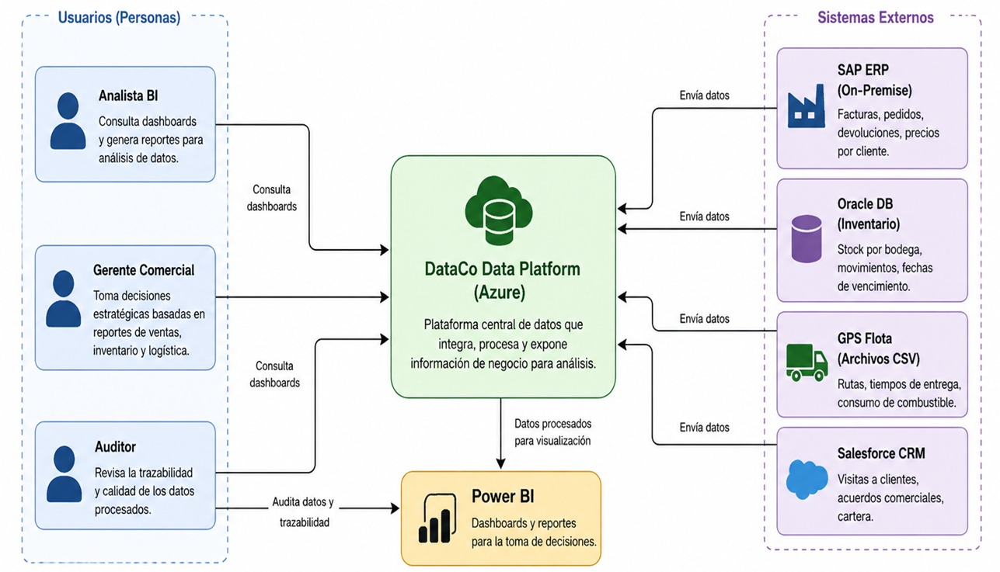
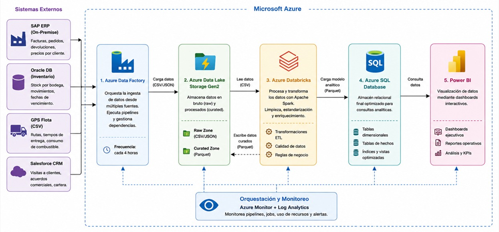
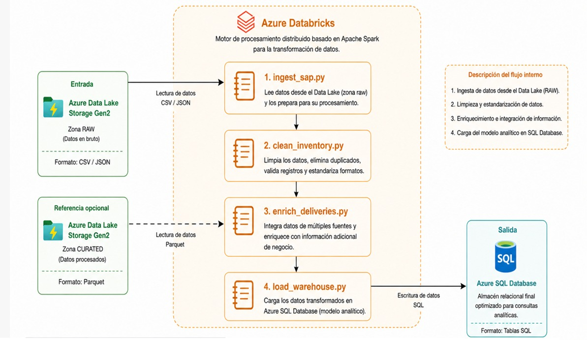
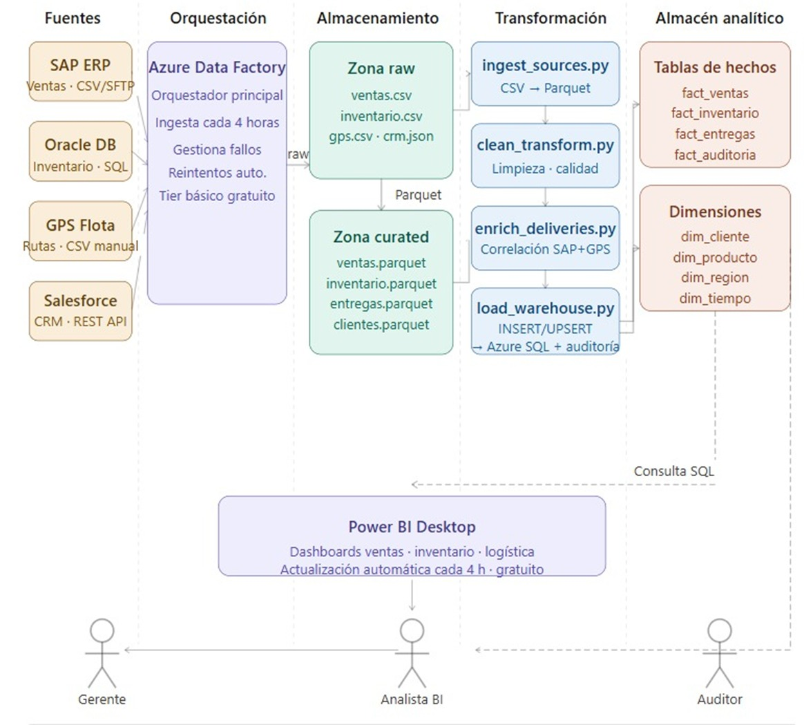

## Introducción
La transformación digital en el sector de distribución y consumo masivo exige que las organizaciones cuenten con sistemas capaces de integrar, procesar y analizar grandes volúmenes de datos provenientes de múltiples fuentes en tiempo casi real. En este contexto, la computación en la nube se ha consolidado como la plataforma tecnológica que permite escalar estas capacidades de forma eficiente, segura y con costos controlados.

El presente trabajo corresponde al Caso 2 de la materia Computación en la Nube del Tecnológico de Antioquia, y plantea el diseño e implementación de un pipeline de datos moderno en Microsoft Azure para la empresa colombiana DataCo. El proyecto aborda los problemas críticos de fragmentación de datos, reportes manuales tardíos y toma de decisiones desactualizada que enfrenta la organización, proponiendo una arquitectura cloud basada en servicios administrados que automatiza completamente el flujo de datos desde las fuentes hasta los dashboards ejecutivos.

La arquitectura propuesta sigue los lineamientos de las arquitecturas de referencia oficiales de Microsoft Azure para pipelines de datos modernos, adaptadas al contexto específico de DataCo: sus restricciones presupuestales, las capacidades técnicas de su equipo y los requerimientos de calidad, trazabilidad y escalabilidad definidos por la gerencia de tecnología.

## Contexto del proyecto

## La empresa

DataCo es una empresa colombiana de distribución de productos de consumo masivo con operaciones en 12 departamentos del país. Fundada en 1998, cuenta con 1.800 empleados, una flota de 320 vehículos de reparto y más de 9.000 puntos de venta activos entre supermercados, tiendas de barrio y droguerías. Maneja tres líneas de negocio principales: distribución de alimentos perecederos (45% de ingresos), productos de aseo del hogar (32%) y cosméticos y cuidado personal (23%).

Situación tecnológica actual
DataCo opera con cuatro sistemas de información que funcionan de forma completamente aislada, sin integración entre ellos:

## Problemas críticos identificados

Esta fragmentación genera cinco problemas que la gerencia ha escalado como prioridad estratégica para 2026:
## 1. Reportes manuales y tardíos: 

El equipo de inteligencia de negocio tarda entre 3 y 5 días hábiles en consolidar información de los cuatro sistemas para generar un informe ejecutivo semanal, mediante exportación manual de Excel y cruce en hojas de cálculo.

## 2. Decisiones desactualizadas: 

la gerencia comercial toma decisiones de abastecimiento con datos de inventario que tienen hasta 72 horas de rezago, generando quiebres de stock y sobrestock simultáneamente.

## 3. Inconsistencia de datos:

los mismos clientes están registrados con nombres distintos en el ERP y el CRM, y los productos tienen códigos diferentes en Oracle y SAP, imposibilitando cualquier análisis cruzado confiable.

## 4. Sin trazabilidad de entregas: 

No existe forma de correlacionar automáticamente una factura de SAP con su entrega real en el GPS, impidiendo medir el cumplimiento de promesas de entrega por ruta o vendedor.

## 5. Escalabilidad nula: 

El servidor de consolidaciones es un equipo de escritorio con Windows Server 2012. En los meses de cierre, el proceso de generación de reportes tarda hasta 8 horas continuas.

## Restricciones del proyecto

- Equipo de datos compuesto por 2 analistas con conocimientos de SQL y Python básico, sin experiencia en Spark ni administración de clusters.

- SAP On-Premise no tiene API REST disponible; la integración se realiza mediante archivos CSV/JSON vía SFTP.

- Presupuesto mensual en Azure máximo de $80 USD durante la fase piloto.

- Los datos de ventas contienen información sensible que requiere control de acceso por roles.

- Power BI Desktop ya está licenciado en la empresa; no se puede proponer una herramienta de visualización con costo adicional.

- El pipeline debe ser tolerante a fallos parciales por fuente.

## Objetivos del proyecto

## Objetivo general

Diseñar e implementar un pipeline de datos moderno en Microsoft Azure que integre las cuatro fuentes de información de DataCo en un modelo de datos unificado, automatizando el proceso de ingesta, transformación y visualización de datos para reducir el ciclo de toma de decisiones de 3 días a menos de 4 horas.

## Objetivos específicos

**1. Integrar las cuatro fuentes de datos (SAP ERP, Oracle Database, GPS Flota y Salesforce CRM)** en un único flujo automatizado de ingesta mediante Azure Data Factory, eliminando el proceso manual de consolidación en Excel.

**2. Implementar un proceso de transformación y calidad de datos** en Azure Databricks que resuelva los problemas de inconsistencia de códigos, duplicados y fechas mal formateadas, garantizando una tasa de registros limpios superior al 98%.

**3. Construir un modelo de datos relacional consolidado** en Azure SQL Database que unifique la información de las cuatro fuentes en tablas de hechos y dimensiones accesibles para análisis desde Power BI Desktop.

**4. Diseñar una arquitectura tolerante a fallos** que garantice que si una fuente falla en un ciclo de ejecución, los datos de las demás fuentes se procesen igualmente sin intervención manual.

**5. Garantizar la trazabilidad completa** de cada transformación aplicada en el pipeline mediante registros de auditoría que cumplan las políticas internas de gobierno de datos de DataCo.

**6. Documentar las decisiones arquitectónicas** mediante Architecture Decision Records (ADRs) que justifiquen la selección de cada servicio del stack frente a sus alternativas, considerando las restricciones técnicas, económicas y organizacionales del proyecto.

## Arquitectura de solución

## Visión general

La arquitectura propuesta para DataCo sigue el patrón Modern Analytics Architecture de Microsoft Azure, adaptado a las restricciones presupuestales y técnicas del proyecto. El pipeline implementa un flujo de datos en capas (medallion architecture) que separa claramente las etapas de ingesta, almacenamiento raw, transformación, almacenamiento curado y visualización.

## Flujo de datos de extremo a extremo

El pipeline se ejecuta en modo batch cada 4 horas siguiendo el siguiente flujo:

**Etapa 1 — Ingesta:** Azure Data Factory detecta los archivos depositados por SAP ERP y GPS Flota vía SFTP, consulta la API REST de Salesforce CRM y exporta los datos de Oracle Database, depositando todo en la zona raw del Data Lake en su formato original (CSV/JSON).

**Etapa 2 — Conversión:** el notebook ingest_sources.py en Databricks lee los archivos de la zona raw y los convierte al formato Parquet, organizándolos en la zona curated del Data Lake particionados por fuente y fecha.

**Etapa 3 — Transformación:** el notebook clean_transform.py aplica las reglas de calidad de datos: eliminación de duplicados, estandarización de fechas, unificación de códigos de producto entre SAP y Oracle, y normalización de nombres de clientes entre ERP y CRM.

**Etapa 4 — Enriquecimiento:** el notebook enrich_deliveries.py correlaciona las facturas de SAP con las entregas del GPS, calculando el cumplimiento de promesas de entrega por ruta y vendedor.

**Etapa 5 — Carga:** el notebook load_warehouse.py realiza operaciones INSERT/UPSERT sobre las tablas de hechos y dimensiones en Azure SQL Database y registra los metadatos de la ejecución en la tabla de auditoría.

**Etapa 6 — Visualización:** Power BI Desktop consulta Azure SQL Database y actualiza automáticamente los dashboards de ventas, inventario y logística disponibles para analistas y gerentes.

## Principios arquitectónicos aplicados

**Separación de responsabilidades:** cada servicio del stack tiene una única responsabilidad bien definida, lo que facilita el mantenimiento, la depuración y la escalabilidad independiente de cada capa.

**Tolerancia a fallos parciales:** el pipeline está diseñado para que el fallo de una fuente no detenga el procesamiento de las demás. Azure Data Factory gestiona los reintentos y Databricks registra los fallos en la tabla de auditoría sin interrumpir el flujo general.

**Mínima complejidad necesaria:** se seleccionaron los servicios más simples que cumplen los requerimientos del caso, evitando añadir capas innecesarias al stack. Esta decisión se documenta explícitamente en los ADRs.

**Control de acceso por capas:** los datos sensibles de precios y márgenes están protegidos mediante ACLs en el Data Lake y RBAC en Azure SQL Database, con credenciales de solo lectura para Power BI y solo escritura para Databricks.

## Decisiones Arquitectónicas [Architecture Decision Records]

Las siguientes decisiones documentan las elecciones tecnológicas clave del proyecto, justificando la selección de cada servicio frente a sus alternativas en el contexto específico de DataCo. Cada ADR considera las restricciones técnicas, económicas y organizacionales definidas en el caso, siguiendo el formato estándar de Architecture Decision Records propuesto por Michael Nygard.

| # | Título | Archivo |
| :--- | :--- | :--- |
| ADR-01 |Uso de Azure Data Factory sobre Azure Logic Apps para la orquestación del pipeline | `adr/ADR-1.md` |
| ADR-002 | Cosmos DB como sistema de almacenamiento principal | `adr/ADR 2.md` |
| ADR-003 | API Management como gateway de entrada | `assets/ADRS/ADR 3.md` |
| ADR-004 | Azure Blob Storage sobre Azure Files para almacenamiento | `assets/ADRS/ADR 4.md` |
| ADR-005 | Azure Notification Hubs sobre Azure Communication Services | `assets/ADRS/ADR 5.md` |

**ADR-01 — **
Estado: **Aceptado**

**Contexto**
DataCo requiere orquestar la ingesta de datos desde cuatro sistemas fuente heterogéneos (SAP ERP vía SFTP, Oracle Database vía exportación, GPS Flota vía CSV manual y Salesforce CRM vía REST API) hacia el Data Lake Storage Gen2, ejecutando este proceso cada 4 horas de forma automática y tolerante a fallos parciales. El equipo de datos está compuesto por 2 analistas con conocimientos de SQL y Python básico, sin experiencia en administración de infraestructura. El presupuesto mensual en Azure no debe superar los $80 USD durante la fase piloto.

**Alternativas evaluadas**

**Opción A — Azure Data Factory**

Herramienta de orquestación de datos nativa de Azure, diseñada específicamente para pipelines ETL/ELT a escala empresarial.
Ofrece conectores nativos para SAP, Oracle, Salesforce y sistemas de archivos SFTP sin necesidad de código adicional.
Interfaz visual de arrastrar y soltar que reduce la curva de aprendizaje para el equipo de DataCo.
Gestión nativa de dependencias entre actividades, reintentos automáticos y tolerancia a fallos parciales por pipeline.
Tier básico gratuito con hasta 5 actividades de bajo costo por mes, suficiente para el volumen del piloto.
Monitoreo integrado con logs de ejecución, alertas y métricas de rendimiento.
Pensado para volúmenes de datos masivos con soporte para hasta millones de registros por ejecución.

**Opción B — Azure Logic Apps**

Herramienta de automatización de flujos de trabajo orientada a la integración de aplicaciones y servicios, no a la ingesta masiva de datos.
Ofrece conectores para Salesforce y sistemas de archivos, pero sin soporte nativo optimizado para SAP On-Premise ni Oracle Database.
El modelo de cobro es por ejecución de acciones individuales, lo que puede generar costos impredecibles con volúmenes altos de datos en ciclos de 4 horas.
No está diseñado para manejar tolerancia a fallos parciales entre pipelines de datos interdependientes.
Carece de monitoreo especializado para pipelines de datos (sin métricas de registros procesados, sin linaje de datos).
Más adecuado para automatización de procesos de negocio ligeros que para orquestación de pipelines ETL a escala.

**Decisión**

Se selecciona **Azure Data Factory** como orquestador del pipeline de DataCo.
Azure Data Factory es la herramienta técnicamente correcta para este caso porque fue diseñada específicamente para orquestar pipelines de datos a escala, ofrece conectores nativos para todas las fuentes de DataCo y su modelo de costos es predecible dentro del presupuesto del piloto. La tolerancia a fallos parciales por pipeline es un requerimiento explícito del caso y Data Factory lo resuelve de forma nativa sin desarrollo adicional. Azure Logic Apps, aunque es una herramienta válida para automatización de procesos, no fue diseñada para este tipo de carga de trabajo y generaría sobrecostos e ineficiencias operativas en el contexto de DataCo.

**Consecuencias**

**Ventajas obtenidas:**

Ingesta automatizada desde las 4 fuentes con conectores nativos, sin desarrollo de integraciones a medida.
Tolerancia a fallos parciales garantizada: si una fuente falla, las demás continúan procesándose.
Monitoreo centralizado de ejecuciones con alertas y logs auditables.
Curva de aprendizaje reducida para el equipo de analistas gracias a la interfaz visual.
Costo dentro del presupuesto piloto de $80 USD/mes con el tier básico gratuito.

**Trade-offs asumidos:**

Azure Data Factory agrega una dependencia adicional al stack de Azure, aumentando levemente la complejidad operativa.
El tier gratuito tiene límites en el número de actividades mensuales, lo que requerirá revisión al escalar a producción.

**ADR-02 — Uso de Azure Databricks sobre Azure Synapse Analytics para la transformación de datos**
Estado: **Aceptado**

**Contexto**
DataCo necesita un motor de transformación capaz de limpiar, estandarizar, enriquecer y consolidar datos provenientes de cuatro sistemas fuente con problemas graves de calidad: códigos de producto inconsistentes entre SAP y Oracle, nombres de clientes duplicados entre ERP y CRM, fechas mal formateadas y registros duplicados. El motor debe procesar hasta 5 millones de registros por ejecución para soportar cierres de mes. El equipo tiene conocimientos básicos de Python y SQL pero ninguna experiencia en Spark ni en administración de clusters. El presupuesto es de máximo $80 USD/mes y se requiere una solución gratuita para la fase piloto.

**Alternativas evaluadas**

**Opción A — Azure Databricks Community Edition**

Plataforma de procesamiento distribuido basada en Apache Spark, con soporte nativo para Python (PySpark) y SQL.
La Community Edition es completamente gratuita, sin necesidad de tarjeta de crédito, con clusters de hasta 15 GB de RAM.
Entorno de notebooks interactivos que facilita el desarrollo iterativo y la depuración de transformaciones, ideal para un equipo con experiencia básica en Python.
Soporte nativo para lectura y escritura de archivos Parquet desde Azure Data Lake Gen2.
Capacidad de procesar millones de registros mediante procesamiento distribuido en Spark, cumpliendo el requerimiento de escalabilidad del caso.
Amplia documentación, comunidad activa y curva de aprendizaje progresiva para equipos que inician con Spark.
Integración nativa con Azure Data Factory para orquestación de notebooks.

**Opción B — Azure Synapse Analytics**

Plataforma unificada de análisis que combina procesamiento de datos, almacén de datos y herramientas de BI en un solo servicio.
No dispone de un tier completamente gratuito equivalente a Databricks Community Edition; los costos de los pools de Spark dedicados superan el presupuesto piloto de $80 USD/mes.
Mayor complejidad de configuración y administración, especialmente para equipos sin experiencia en plataformas de datos distribuidos.
Adecuado para organizaciones que buscan consolidar análisis, ingesta y visualización en una única plataforma, lo cual no es el objetivo de DataCo en esta fase.
La propuesta de valor principal de Synapse (unificación de servicios) no aplica en este caso, ya que DataCo ya tiene definido un stack con servicios especializados.

**Decisión**

Se selecciona **Azure Databricks Community Edition** como motor de transformación del pipeline de DataCo.
La decisión está fundamentada en tres factores determinantes del caso: costo cero durante el piloto, capacidad de procesamiento distribuido para 5 millones de registros y entorno de notebooks compatible con las habilidades actuales del equipo (Python básico). Azure Synapse Analytics, aunque es técnicamente más completo, excede el presupuesto del piloto y su complejidad de configuración representa un riesgo operativo para un equipo de 2 analistas sin experiencia en plataformas distribuidas.

**Consecuencias**

**Ventajas obtenidas:**

Costo cero en la fase piloto con Databricks Community Edition.
Capacidad de procesar hasta 5 millones de registros por ejecución mediante Spark distribuido.
Entorno de notebooks que facilita el desarrollo iterativo y la colaboración del equipo.
Escalabilidad garantizada para temporadas altas y cierres de mes.

**Trade-offs asumidos:**

La Community Edition no tiene SLA de disponibilidad, lo que la hace inadecuada para entornos de producción críticos a futuro.
Los clusters se terminan automáticamente tras períodos de inactividad, lo que puede generar tiempos de inicio en cada ejecución del pipeline.
Al escalar a producción, será necesario migrar a un tier de pago de Databricks o evaluar nuevamente Synapse Analytics.

**ADR-03 — Uso de Azure Data Lake Storage Gen2 sobre Azure Blob Storage estándar como almacenamiento raw**
Estado: **Aceptado**

**Contexto**

DataCo necesita un sistema de almacenamiento capaz de recibir archivos en formato CSV y JSON desde cuatro fuentes heterogéneas, organizarlos por fuente y fecha de ingesta, y servirlos como entrada al motor de transformación en Databricks. Los datos contienen información sensible de precios y márgenes por cliente, por lo que el acceso debe estar controlado por roles. El pipeline debe escalar para procesar hasta 5 millones de registros y los requerimientos de trazabilidad exigen auditoría completa de cada operación sobre los datos.

**Alternativas evaluadas**

**Opción A — Azure Data Lake Storage Gen2**

Servicio de almacenamiento de objetos construido sobre Azure Blob Storage pero con capacidades adicionales para cargas de trabajo analíticas a escala.
Implementa un sistema de archivos jerárquico (ADLS) que permite organizar los datos en directorios por fuente, año, mes y día, facilitando la partición y el acceso eficiente desde Spark.
Soporte nativo para control de acceso granular mediante ACLs (Access Control Lists) a nivel de archivo y directorio, cumpliendo el requerimiento de restricción de acceso a datos sensibles de DataCo.
Integración nativa con Azure Databricks y Azure Data Factory sin configuración adicional.
Optimizado para cargas de trabajo analíticas de alto rendimiento con soporte para el formato Parquet.
Compatible con el protocolo ABFS (Azure Blob File System), que ofrece mejor rendimiento en operaciones de lectura/escritura masiva comparado con el protocolo REST estándar de Blob Storage.
Mismo modelo de costos que Blob Storage estándar (LRS Standard), sin sobrecosto por las capacidades adicionales.

**Opción B — Azure Blob Storage estándar**

Servicio de almacenamiento de objetos de propósito general de Azure, sin sistema de archivos jerárquico nativo.
No soporta ACLs a nivel de directorio o archivo; el control de acceso se limita a nivel de contenedor, lo que impide la granularidad requerida para proteger los datos sensibles de precios y márgenes de DataCo.
Menor rendimiento en operaciones de lectura/escritura masiva desde Spark en comparación con Data Lake Gen2 para cargas analíticas.
No está optimizado para patrones de acceso analítico (partición por fecha, lectura selectiva de columnas en Parquet).
Adecuado para almacenamiento de archivos estáticos, backups o contenido web, no para pipelines de datos analíticos.

**Decisión**

Se selecciona **Azure Data Lake Storage Gen2** como capa de almacenamiento del pipeline de DataCo.
El sistema de archivos jerárquico y el control de acceso granular mediante ACLs son los factores determinantes: DataCo maneja datos sensibles de precios y márgenes que requieren restricción de acceso a nivel de directorio, algo que Blob Storage estándar no puede garantizar. Adicionalmente, el rendimiento superior de ADLS Gen2 en operaciones analíticas con Spark es crítico para cumplir el requerimiento de procesar 5 millones de registros por ejecución dentro del ciclo de 4 horas. El hecho de que no represente costo adicional sobre Blob Storage estándar elimina cualquier trade-off económico.

**Consecuencias**

**Ventajas obtenidas:**

Control de acceso granular a nivel de archivo y directorio para proteger datos sensibles.
Organización jerárquica por fuente y fecha que facilita la partición eficiente en Spark.
Rendimiento optimizado para operaciones analíticas masivas.
Soporte nativo para Parquet como formato estándar en la zona curated.
Sin costo adicional respecto a Blob Storage estándar.

**Trade-offs asumidos:**

La configuración de ACLs requiere una gestión de identidades más cuidadosa que Blob Storage, añadiendo complejidad operativa inicial.
El equipo deberá familiarizarse con el modelo de permisos POSIX de ADLS Gen2, diferente al modelo de roles de Blob Storage.

**ADR-04 — Uso de Azure SQL Database sobre Azure Cosmos DB para el almacén analítico final**
Estado: **Aceptado**

**Contexto**

DataCo necesita un almacén de datos relacional que consolide los resultados del pipeline de transformación en un modelo estructurado, accesible para consultas analíticas desde Power BI Desktop y para consultas SQL directas por parte del equipo de analistas. Los datos de ventas contienen información sensible de precios y márgenes, por lo que el acceso debe estar restringido por roles. El equipo tiene conocimientos de SQL pero ninguna experiencia con bases de datos NoSQL. El presupuesto del piloto no debe superar $80 USD/mes.

**Alternativas evaluadas**

**Opción A — Azure SQL Database**

Motor de base de datos relacional completamente administrado basado en SQL Server, optimizado para consultas estructuradas y cargas de trabajo analíticas.
Soporte nativo para el modelo dimensional (tablas de hechos y dimensiones) que requiere el caso de DataCo.
Conector nativo en Power BI Desktop mediante SQL Server, sin configuración adicional ni licencias extra.
Control de acceso por roles (RBAC) mediante usuarios de base de datos con permisos granulares por tabla y vista.
Free tier disponible con 32 GB de almacenamiento y 100.000 vCores/mes, suficiente para la fase piloto.
Soporte para vistas e índices columnares que optimizan el rendimiento de las consultas analíticas de Power BI.
Familiar para el equipo de analistas de DataCo que tiene conocimientos de SQL.
Integración directa con Azure Databricks mediante JDBC para carga de datos desde notebooks.

**Opción B — Azure Cosmos DB**

Base de datos NoSQL distribuida globalmente, optimizada para cargas de trabajo de baja latencia con modelos de datos flexibles (documentos JSON, grafos, clave-valor).
No soporta el modelo relacional dimensional requerido por DataCo (tablas de hechos y dimensiones con JOINs complejos).
La integración con Power BI Desktop requiere configuración adicional mediante el conector de Cosmos DB o Azure Synapse Link, añadiendo complejidad y posibles costos adicionales.
El modelo de consulta basado en particiones y claves de partición no es intuitivo para analistas con experiencia en SQL relacional.
Los costos de Cosmos DB (basados en Request Units) son significativamente más altos para cargas de trabajo analíticas con consultas complejas, superando el presupuesto del piloto.
Diseñado para aplicaciones transaccionales de alta disponibilidad global, no para almacenes analíticos con consultas ad-hoc complejas.

**Decisión**

Se selecciona **Azure SQL Database** como almacén analítico final del pipeline de DataCo.
El modelo relacional es la elección natural para este caso por tres razones fundamentales: el equipo tiene experiencia en SQL y puede operar el almacén sin curva de aprendizaje adicional, Power BI Desktop se conecta nativamente sin configuración adicional, y el Free Tier cubre los requerimientos del piloto sin costo. Azure Cosmos DB resolvería problemas que DataCo no tiene (baja latencia global, esquema flexible) mientras generaría nuevos problemas que sí tiene (costos elevados, incompatibilidad con el conocimiento del equipo, complejidad de integración con Power BI).

**Consecuencias**

**Ventajas obtenidas:**

Modelo dimensional familiar para el equipo de analistas con conocimientos de SQL.
Conexión nativa con Power BI Desktop sin configuración adicional.
Control de acceso por roles granular para proteger datos sensibles de precios y márgenes.
Costo cero en la fase piloto con el Free Tier de Azure SQL.
Soporte para vistas e índices columnares que optimizan consultas analíticas complejas.

**Trade-offs asumidos:**

Azure SQL Database es un motor relacional optimizado para consultas estructuradas; para cargas de trabajo de análisis masivo a futuro (más de 32 GB), será necesario evaluar Azure Synapse Analytics o migrar a un tier de pago.
El Free Tier tiene límites de cómputo (100.000 vCores/mes) que podrían afectar el rendimiento en períodos de alta demanda como cierres de mes.

**ADR-05 — Uso de Power BI Desktop sobre Azure Analysis Services para la capa de visualización**
Estado: **Aceptado**

**Contexto**
DataCo requiere una herramienta de visualización que permita a los analistas de BI y gerentes comerciales consumir dashboards actualizados automáticamente cada 4 horas con datos de ventas, inventario y logística. La herramienta debe conectarse a Azure SQL Database como fuente de datos. Power BI Desktop ya está licenciado e instalado en los equipos de los analistas de DataCo. El presupuesto del piloto no permite herramientas de visualización con costo adicional. El equipo de datos tiene experiencia básica en herramientas de BI pero no en modelado semántico avanzado.

**Alternativas evaluadas**

**Opción A — Power BI Desktop**

Herramienta de visualización y análisis de datos de Microsoft, gratuita en su versión Desktop.
Ya está licenciada e instalada en los equipos de los analistas de DataCo, eliminando cualquier costo adicional y tiempo de onboarding.
Conector nativo para Azure SQL Database mediante SQL Server, con configuración en menos de 5 minutos.
Soporte para actualización programada de datos cada 4 horas, alineado con el ciclo del pipeline.
Interfaz de arrastrar y soltar para creación de dashboards, accesible para analistas con conocimientos básicos de BI.
Amplia comunidad, documentación en español y recursos de aprendizaje gratuitos disponibles.
Permite publicar reportes en Power BI Service (versión cloud) si DataCo decide escalar la distribución de dashboards en el futuro.

**Opción B — Azure Analysis Services**

Servicio de modelado semántico empresarial en la nube que actúa como capa intermedia entre las fuentes de datos y las herramientas de visualización.
Requiere una suscripción de pago (desde $85 USD/mes en el tier Developer), superando el presupuesto total del piloto de DataCo.
Añade una capa adicional de complejidad al stack: el modelo semántico debe ser diseñado, mantenido y administrado por el equipo, lo que requiere experiencia en DAX y modelado tabular que el equipo no posee.
Su propuesta de valor principal es la capacidad de servir modelos semánticos complejos a miles de usuarios concurrentes, una necesidad que DataCo no tiene en la fase piloto con 2 analistas y 1 gerente.
No elimina la necesidad de Power BI Desktop como herramienta de visualización final; simplemente añade una capa intermedia de procesamiento.

**Decisión**

Se selecciona **Power BI Desktop** como herramienta de visualización del pipeline de DataCo.
La decisión está completamente respaldada por las restricciones explícitas del caso: Power BI Desktop ya está licenciado en DataCo, su costo es cero y se conecta nativamente a Azure SQL sin configuración adicional. Azure Analysis Services resolvería necesidades de escala (miles de usuarios concurrentes, modelos semánticos complejos) que DataCo no tiene en esta fase, mientras generaría un costo mensual que por sí solo superaría el presupuesto total del piloto. La regla de arquitectura aplicada es la de mínima complejidad necesaria: no añadir capas al stack si la herramienta existente cumple los requerimientos.

**Consecuencias**

**Ventajas obtenidas:**

Costo cero al aprovechar la licencia existente de Power BI Desktop en DataCo.
Conexión nativa a Azure SQL Database sin configuración adicional.
Actualización automática de dashboards cada 4 horas alineada con el ciclo del pipeline.
Curva de aprendizaje mínima para el equipo de analistas que ya conoce la herramienta.
Posibilidad de escalar a Power BI Service en el futuro sin cambiar la herramienta de visualización.

**Trade-offs asumidos:**

Power BI Desktop es una aplicación local; los dashboards no son accesibles desde el navegador ni desde dispositivos móviles sin migrar a Power BI Service (requiere licencia Pro a futuro).
Sin Azure Analysis Services, las consultas analíticas complejas impactan directamente en Azure SQL Database, lo que podría afectar el rendimiento en escenarios de alta concurrencia de usuarios a futuro.

## C1 – Diagrama de contexto - Plataforma de datos DataCo en Azure

El diagrama de contexto presenta una visión general de la plataforma de datos de DataCo como un sistema central dentro del ecosistema de la organización.

En este nivel se identifican los principales actores del negocio, incluyendo el Analista de BI, quien utiliza los dashboards para el análisis de datos; el Gerente Comercial, que toma decisiones estratégicas basadas en la información procesada; y el Auditor, encargado de verificar la trazabilidad y calidad de los datos.

Asimismo, se representan los sistemas externos que generan la información de negocio. Estos incluyen el ERP de ventas SAP, el sistema de inventario en Oracle, los archivos CSV provenientes del sistema GPS de la flota y el CRM Salesforce. Cada uno de estos sistemas envía datos hacia la plataforma central.

La plataforma de datos en Azure actúa como el núcleo que integra, procesa y consolida la información proveniente de todas las fuentes. Una vez procesados los datos, estos son consumidos a través de Power BI, que permite la visualización mediante dashboards interactivos.

Este nivel de abstracción permite entender cómo interactúan los diferentes actores y sistemas con la solución, sin entrar en detalles técnicos de implementación.

## C2 – Diagrama de Contenedores - Plataforma de datos DataCo en Azure

El diagrama de contenedores representa la arquitectura de la plataforma de datos de DataCo implementada en Microsoft Azure. Este muestra cómo los diferentes servicios trabajan de manera integrada para procesar y transformar los datos provenientes de múltiples fuentes.

El flujo de datos inicia con Azure Data Factory, que se encarga de orquestar la ingesta de información desde los sistemas externos en formato CSV o JSON. Estos datos son almacenados inicialmente en Azure Data Lake Storage Gen2 en la zona RAW.

Posteriormente, Azure Databricks procesa los datos utilizando Apache Spark, realizando tareas de limpieza, estandarización y enriquecimiento. Los datos transformados se almacenan nuevamente en el Data Lake en formato Parquet dentro de la zona CURATED.

Una vez procesados, los datos son cargados en Azure SQL Database, donde se estructuran en un modelo relacional optimizado para consultas analíticas.

Finalmente, Power BI se conecta a Azure SQL Database para visualizar la información mediante dashboards interactivos que apoyan la toma de decisiones del negocio.

El pipeline se ejecuta de manera automatizada cada 4 horas, permitiendo que la información esté actualizada y disponible para los usuarios en tiempo casi real.

## C3 – Diagrama de Componentes - Detalle de Azure Databricks en la Plataforma DataCo

El diagrama de componentes representa el funcionamiento interno de Azure Databricks dentro de la arquitectura de datos de DataCo. En este nivel se detallan los diferentes notebooks responsables del procesamiento y transformación de los datos.

El flujo inicia con el notebook ingest_sap.py, el cual se encarga de leer los datos almacenados en la zona RAW del Data Lake en formatos como CSV o JSON. Este componente prepara los datos para su posterior procesamiento.

Luego, el notebook clean_inventory.py realiza la limpieza de los datos, eliminando duplicados, corrigiendo formatos incorrectos y estandarizando la información, lo que permite mejorar la calidad de los datos.

Posteriormente, el notebook enrich_deliveries.py integra información proveniente de múltiples fuentes, enriqueciendo los datos con atributos adicionales necesarios para el análisis de negocio, como categorías de productos o relaciones entre entidades.

Finalmente, el notebook load_warehouse.py carga los datos ya transformados en Azure SQL Database, donde se estructuran en un modelo analítico optimizado para consultas.

Adicionalmente, los datos procesados pueden almacenarse en el Data Lake en la zona CURATED en formato Parquet, permitiendo su reutilización y optimización en futuras consultas.

## Arquitectura de solución - Pipeline de datos DataCo

Este flujo de procesamiento se ejecuta de forma secuencial y automatizada, asegurando que los datos pasen por cada etapa de transformación hasta estar listos para su consumo en herramientas analíticas.

## Conclusiones

## Sobre el problema resuelto

DataCo enfrentaba una situación crítica común en empresas de distribución de consumo masivo en Colombia: datos valiosos atrapados en sistemas aislados, procesos manuales que consumían días de trabajo y decisiones gerenciales tomadas con información desactualizada. El diseño e implementación del pipeline de datos en Microsoft Azure demuestra que es posible transformar esta realidad con un stack tecnológico moderno, completamente administrado y dentro de un presupuesto controlado de $80 USD mensuales durante la fase piloto.
El pipeline logra reducir el ciclo de consolidación de datos de 3 a 5 días hábiles a un máximo de 4 horas, cumpliendo el requerimiento principal de la gerencia de tecnología de DataCo y habilitando una toma de decisiones basada en datos reales y actualizados.

## Sobre la arquitectura diseñada

La arquitectura propuesta demuestra que el patrón Modern Analytics Architecture de Microsoft Azure es aplicable no solo a grandes corporaciones con presupuestos ilimitados, sino también a empresas medianas colombianas con restricciones reales de presupuesto, equipo y tiempo. La clave está en la correcta selección de los tiers gratuitos y de bajo costo disponibles en Azure: Databricks Community Edition, Azure SQL Free Tier y Power BI Desktop conforman un stack de transformación y visualización de costo cero, complementado por Azure Data Factory y Data Lake Storage Gen2 con costos mínimos por uso.

La separación del almacenamiento en zonas raw y curated (patrón medallion) resultó fundamental para garantizar la trazabilidad de los datos y permitir la reejección de transformaciones sin pérdida de información original, un principio que toda arquitectura de datos moderna debe contemplar.

Sobre las decisiones arquitectónicas

Los cinco ADRs documentados en este proyecto reflejan una lección central de la arquitectura de software: **la mejor decisión técnica no es siempre la más sofisticada, sino la que mejor se ajusta al contexto específico del problema.** Azure Synapse Analytics, Azure Cosmos DB y Azure Analysis Services son tecnologías más completas que sus alternativas seleccionadas, pero en el contexto de DataCo representarían sobrecostos, complejidad innecesaria y una curva de aprendizaje que el equipo no podría absorber en la fase piloto.

La documentación explícita de estas decisiones mediante ADRs es una práctica profesional que agrega valor más allá del proyecto inmediato: permite que futuros integrantes del equipo comprendan por qué se tomaron ciertas decisiones, qué alternativas se evaluaron y qué trade-offs se asumieron conscientemente, evitando que se repita el proceso de evaluación ante cada cambio.

## Sobre la calidad de datos

Uno de los hallazgos más relevantes del proyecto es que los problemas de calidad de datos de DataCo no son un problema tecnológico sino un problema de proceso y gobernanza que la tecnología puede resolver pero no puede prevenir por sí sola. La estandarización de códigos de producto entre SAP y Oracle, la normalización de nombres de clientes entre ERP y CRM y la correlación de facturas con entregas GPS son transformaciones que el pipeline ejecuta automáticamente, pero su causa raíz es la ausencia histórica de estándares de datos en la organización.

Se recomienda a DataCo acompañar la implementación técnica del pipeline con un proceso de gobernanza de datos que establezca estándares de nomenclatura, códigos maestros unificados y políticas de calidad en los sistemas fuente, reduciendo progresivamente la carga de limpieza en la capa de transformación.

**Sobre la escalabilidad futura**

La arquitectura implementada en la fase piloto es una base sólida sobre la cual DataCo puede escalar progresivamente. Se identifican tres caminos de evolución natural:

**Corto plazo:** migrar de Databricks Community Edition a un tier de pago cuando el pipeline pase a producción, garantizando SLA de disponibilidad y soporte técnico para un proceso crítico del negocio.

**Mediano plazo:** incorporar procesamiento en tiempo real mediante Azure Event Hubs y Databricks Structured Streaming para reducir la latencia de 4 horas a minutos en los datos de ventas e inventario, habilitando alertas automáticas de quiebre de stock.

**Largo plazo:** evaluar la migración del almacén analítico a Azure Synapse Analytics cuando el volumen de datos supere los límites del Free Tier de Azure SQL y el número de usuarios concurrentes de Power BI justifique una capa semántica dedicada.

**Reflexión final**

Este proyecto evidencia que la computación en la nube no es exclusiva de las grandes empresas tecnológicas. Con una arquitectura bien diseñada, decisiones fundamentadas y un uso inteligente de los tiers gratuitos disponibles en Microsoft Azure, una empresa colombiana de distribución puede construir una plataforma de datos moderna, escalable y segura que transforme la manera en que toma decisiones. La nube no es un destino, es un habilitador: el valor real lo generan los datos, el diseño y las personas que los usan.

## Implementacion

**Creación del Data Lake y almacenamiento RAW**
Se configuró el contenedor RAW dentro de la cuenta de almacenamiento pipelinedatafor.
Allí se cargó el archivo ventas_dataco.csv en formato CSV, representando la información original de ventas.

Durante esta etapa se validó:

-Creación correcta del contenedor RAW.

-Carga inicial del archivo CSV.

-Disponibilidad de los datos en el Data Lake

**Generación de la zona CURATED**
Se creó el contenedor CURATED, destinado a almacenar los datos procesados.
El archivo limpio ventas_clean.csv fue generado con la columna calculada valor_total = cantidad × valor_unitario.

**Validaciones realizadas:**

-Separación entre datos crudos y datos procesados.

-Archivo _SUCCESS confirmando ejecución correcta del flujo.

**Orquestación del pipeline con Azure Data Factory**

Se implementó el pipeline pipeline_dataco en Data Factory.
**Este pipeline incluyó:**

-Actividad Copy Data para mover el archivo desde RAW.

-Actividad Data Flow para aplicar transformaciones y crear la columna valor_total.

**Validaciones realizadas:**

-Ejecución con estado Succeeded.

-Tiempo de ejecución correcto.

-Flujo automatizado de datos desde RAW hacia CURATED.

**Lectura y validación en Databricks**

Se utilizó el notebook **dataco_limpieza_azure** en Databricks para leer el archivo CSV desde el contenedor RAW.
El código en Python cargó los datos con pandas y spark, mostrando los primeros registros y confirmando la carga de 1250 registros.

**Transformaciones aplicadas:**

-Visualización de registros crudos para validación.

**Script Python y conexión exitosa a Azure SQL Database**

Se evidencia la implementación del script cargar_sql.py en Visual Studio Code, utilizado para establecer la conexión con la base de datos dataco_db en Azure SQL Database.

El script emplea la librería pyodbc junto con el ODBC Driver 17 for SQL Server. Durante esta etapa se validó:

-Conexión exitosa entre Python y Azure SQL.

-Corrección del error inicial de firewall agregando la IP local en el portal de Azure.

-Ejecución de sentencias SQL para limpiar y cargar la tabla ventas_hechos.

**Validación en Azure SQL Database**

Finalmente, se ejecutaron consultas SQL en la base dataco_db para validar la carga:

-Confirmación de registros cargados correctamente.

-Visualización de la columna valor_total calculada.

**Conclusiones**

Se logró implementar un flujo ETL completo con Data Factory, Databricks, Python y Azure SQL Database.

-Los datos fueron organizados en capas RAW y CURATED, garantizando trazabilidad.

-La conexión Python–SQL permite automatizar la carga de datos en la base relacional.

-Las consultas en SQL validan la disponibilidad y calidad de la información procesada.

